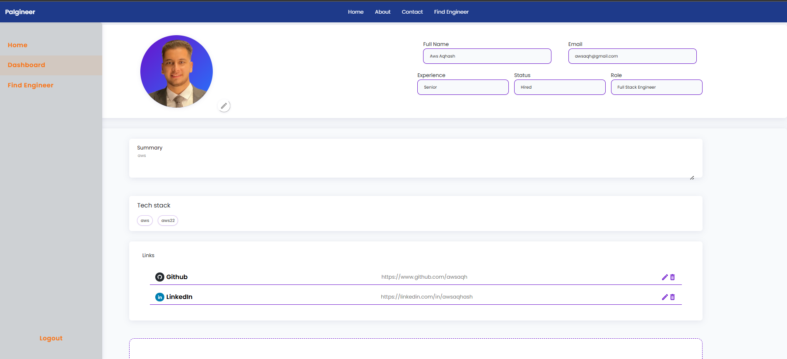

# Palgineer

Palgineer is a modern platform designed to help tech companies in Palestine discover and connect with talented software engineers. Unlike traditional job boards, Palgineer empowers engineers to showcase their skills, experience, and availability, while companies search and filter for the ideal candidates. For software engineers, this means they never miss out on internship or employment opportunities simply because a company closed an application before they even knew about it.


#Note: to run this app, use the backend service from palgineer-backend repo (https://github.com/awsaqh/palgineer-backend) and follow readme file.

## Features
- Engineer-centric profiles: showcase skills, experience, status (available, hired, etc.) and CV.
- Company search and filtering for engineers
- Responsive, modern dashboard UI
- Editable profile, tech stack, and resume upload
- Add and manage social/professional links
- Sidebar navigation with persistent layout
- Avatar/profile picture upload

## Screenshots

### Homepage

*Landing page showcasing the platform's mission and features*

### Engineer Dashboard

*Personal dashboard where engineers can manage their profile, skills, and availability*

### Engineer Profile View

*Public profile view showing engineer's skills, experience, and contact information*

### Find Engineers Page

*Search and filter interface for companies to discover talented engineers*

### Registration Page

*User registration form with comprehensive profile setup*


## Tech Stack
- **Frontend:** React, CSS (custom, no framework), Material UI Icons
- **State Management:** React Hooks
- **Styling:** Custom CSS, Flexbox, Responsive Design

## Getting Started

### Prerequisites
- Node.js (v14+ recommended)
- npm or yarn

### Installation
1. Clone the repository:
   ```bash
   git clone https://github.com/awsaqh/palgineer.git
   cd palgineer
   ```
2. Install dependencies:
   ```bash
   npm install
   # or
   yarn install
   ```
3. Start the development server:
   ```bash
   npm start
   # or
   yarn start
   ```
4. Open [http://localhost:3000](http://localhost:3000) in your browser.

## Folder Structure
```
src/
  ├── Pages/           # Main page components (Home, Dashboard, Register, etc.)
  ├── Componetns/      # Reusable UI components (Header, Footer, FieldCard, etc.)
  ├── styles/          # CSS files for each page/component
  ├── assets/          # Images and static assets
  ├── App.jsx          # Main app component
  ├── index.css        # Global CSS variables and utilities
  └── ...
```

## Usage
- Register as a software engineer and fill out your profile.
- Add your skills, experience, and set your availability status.
- Upload your resume and profile picture.
- Add social/professional links (LinkedIn, GitHub, etc.).
- Companies can search and filter engineers based on skills and status.

## Contribution
Contributions are welcome! To contribute:
1. Fork the repository
2. Create a new branch (`git checkout -b feature/your-feature`)
3. Commit your changes (`git commit -am 'Add new feature'`)
4. Push to the branch (`git push origin feature/your-feature`)
5. Open a pull request

## License
This project is licensed under the MIT License.
